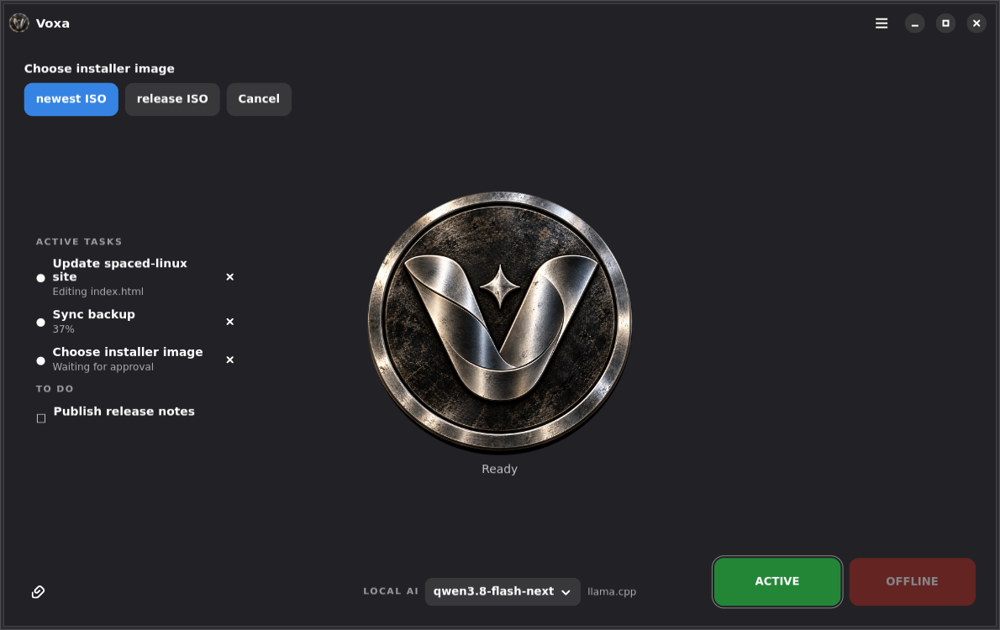

# Voxa

<p align="center">
  <br>
  <strong>Local-first voice assistant for Linux</strong>
</p>

**Voxa is a local-first voice assistant for Linux that can listen, converse, and carry out desktop tasks using local AI.**

Voxa combines on-device speech recognition, selectable local AI backends, spoken replies, task state, and desktop-oriented capabilities in a native GTK 4 / libadwaita application. It is being developed as a major assistant component for **Spaced Linux**, while remaining useful on other Linux desktops.

**Website:** [voxaai.me](https://voxaai.me)



## Highlights

- **Voice-first interaction** with wake-word conversation.
- **On-device transcription** with Faster Whisper.
- **Local AI** through supported **llama.cpp** and **Ollama** backends.
- **Local model selection** from the assistant interface.
- **Bounded conversation memory** for useful follow-up context without unlimited prompt growth.
- **Spoken replies** with Edge TTS and an offline eSpeak NG fallback.
- **Barge-in** so speaking can interrupt Voxa's reply.
- **Real assistant state** coordinated through `AssistantModel` and `AssistantController`.
- **Task-oriented UI** rather than a conventional permanent chat interface.
- **Desktop capabilities** for applications, documents, mail and web-oriented workflows as the capability system develops.
- **Reactive assistant presence** plus an experimental OpenGL/GLB 3D renderer with a safe static fallback.
- **Hardware-aware model suggestions** based on available VRAM/RAM.
- **Flatpak-first distribution** with CI validation and an update repository.

## Local-first, not local-only

Core Voxa functionality can run locally: Faster Whisper handles speech recognition, llama.cpp or Ollama can provide inference, eSpeak NG provides offline speech, and configuration remains local.

Optional features may use the network. Edge TTS is a network speech service, model installation requires downloads, web features access the internet, and future communication integrations may contact external services.

## Interface philosophy

Voxa is intentionally **voice-first**. The production interface centers the assistant, its current work and local-AI state instead of becoming a dense chat client.

It emphasizes:

- a centered assistant presence;
- compact task/activity information;
- visible backend and model selection;
- clear **ACTIVE** and **OFFLINE** controls;
- voice as the primary interaction method;
- minimal visual clutter.

The original transcript/dictation interface remains available from the application menu.

## Install

Download a Flatpak bundle from [GitHub Releases](https://github.com/crhy/voxa/releases):

```bash
flatpak install --user Voxa-<version>-x86_64.flatpak
flatpak run io.github.crhy.voxa
```

Release/update details are in [docs/RELEASING.md](docs/RELEASING.md).

## Local AI

Voxa supports local inference through **llama.cpp** and **Ollama**.

For Ollama, Preferences includes installation and model-management controls. Manual setup:

```bash
curl -fsSL https://ollama.com/install.sh | sh
ollama pull qwen2.5:0.5b
```

For llama.cpp, run a compatible local server and select the llama.cpp backend in Voxa.

## Run from source

Voxa requires Python 3.11+, GTK 4, libadwaita, GStreamer and Python GObject bindings.

```bash
git clone https://github.com/crhy/voxa.git
cd voxa
python3 -m venv .venv
.venv/bin/pip install -r requirements.txt
.venv/bin/python voxa.py
```

Installed entry points are `voxa`, `voxa-backup`, and `voxatest`.

## VoxaTest

VoxaTest is the end-to-end voice harness shipped with the source package. It can
generate cases with the configured local model, speak them to a running Voxa
instance, capture and transcribe Voxa's reply, grade it, and write JSON/text
reports. It follows Voxa's selected llama.cpp or Ollama backend unless the
`VOXATEST_BACKEND`, `VOXATEST_MODEL`, or `VOXATEST_URL` environment variables
override it.

```bash
voxatest generate --count 25
voxatest run --limit 5
```

The default cases are installed with the package. Running the full harness
requires working speaker/microphone routing and a separately running Voxa
instance; unit tests use a simulated audio pipeline.

## Keyboard shortcuts

| Shortcut | Action |
| --- | --- |
| `Ctrl+R` | Start or stop dictation |
| `Ctrl+Shift+R` | Start or stop conversation mode |
| `Ctrl+Enter` | Ask AI |
| `Ctrl+Shift+C` | Copy transcript |
| `Ctrl+Shift+V` | Copy AI response |
| `Ctrl+L` | Clear |
| `Ctrl+,` | Preferences |
| `Ctrl+Q` | Quit |

## Configuration

Settings are stored in `$XDG_CONFIG_HOME/voxa/config.json`. Backup and restore are documented in [docs/BACKUP.md](docs/BACKUP.md).

## Architecture

The production UI is driven by an `AssistantModel` and `AssistantController`. Audio, transcription, speech, inference and desktop capabilities sit behind that orchestration instead of making widgets responsible for application behavior.

See **[docs/ARCHITECTURE.md](docs/ARCHITECTURE.md)** for the current component map, architectural rules, backend direction, security model and planned agent/capability system.

## Agent direction

Voxa is evolving toward this deterministic pipeline:

```text
voice
  -> transcription
  -> intent / planning
  -> structured capability request
  -> schema validation
  -> permission policy
  -> task execution
  -> structured result
  -> spoken response
```

The model may propose work, but model output should never be equivalent to unrestricted desktop or shell authority. Consequential actions should pass through deterministic validation, policy and confirmation.

## Development priorities

The next architectural foundation is:

1. normalized local-AI backend interface;
2. structured capability registry;
3. argument/schema validation;
4. deterministic permission policy;
5. confirmation UI for consequential actions;
6. task lifecycle and cancellation;
7. a small initial set of safe desktop tools.

## Building

CI validates compilation, linting, unit tests, GTK/window tests, AppStream metadata, the desktop file, the Flatpak manifest and generated bundle/OSTree behavior.

See [docs/RELEASING.md](docs/RELEASING.md) for release mechanics.

## Contributing

Issues and pull requests are welcome. Read [docs/ARCHITECTURE.md](docs/ARCHITECTURE.md) before major architectural work.

New code should preserve these principles: state-driven UI, non-blocking GTK behavior, interchangeable AI backends, stale-result rejection, deterministic permissions for side effects, and graceful fallback for optional features.

## Acknowledgements

- [Faster Whisper](https://github.com/SYSTRAN/faster-whisper)
- [Ollama](https://ollama.com/)
- [llama.cpp](https://github.com/ggml-org/llama.cpp)
- [Edge TTS](https://github.com/rany2/edge-tts)
- [eSpeak NG](https://github.com/espeak-ng/espeak-ng)
- GTK 4, libadwaita and GStreamer

## License

MIT — see [LICENSE](LICENSE).
